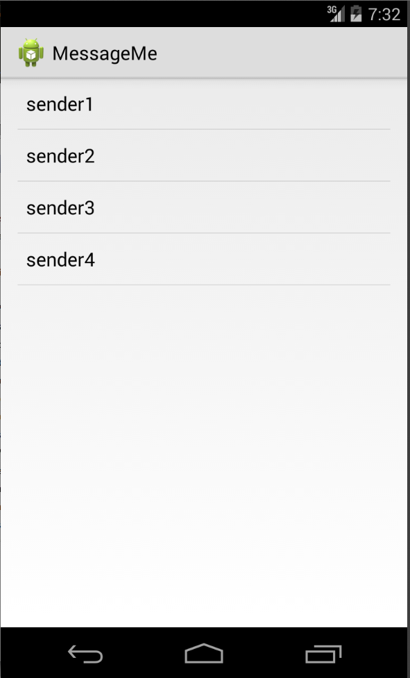
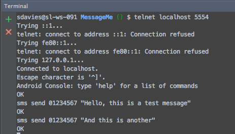
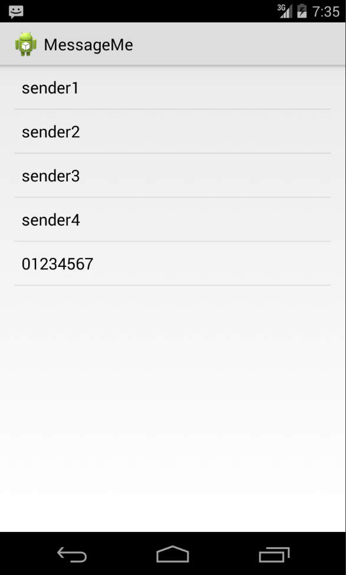
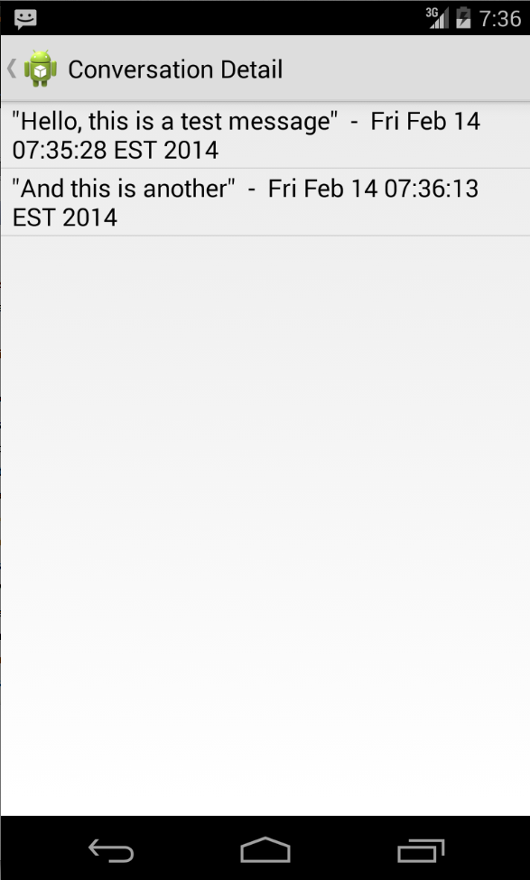

# Android KitKat: finger-by-finger 

## Introduction

Before KitKat it has been possible to build fully-featured SMS apps on Android,
but it has involved using hidden APIs - somewhat less than ideal. In KitKat
Android opens up these APIs to allow developers to create apps which replace
the default SMS app - in the same way the Google Hangouts can.

In this week's article we'll take a look at what you need to do to be able to
create your own SMS app on KitKat, but first we'll have a look at how you can
receive SMS messages without taking the responsibility of being the default SMS
app on the device.

The code for the app which accompanies this article is available on Github at
GITHUB_LINK_HERE. It was developed in Android Studio 0.4.4 and therefore is a
gradle project. Any problems then feel free to give me a shout or create a pull
request to fix it :)

## Reading SMS messages

Right from the beginnings of Android, developers have been able to register to
receive SMS messages in their app - using the `RECEIVE_SMS` permission. We'll
take a brief look at how to achieve this so we can get a handle on what functionality
KitKat has added.

In order to handle incoming SMS messages we need to create a `BroadcastReceiver`,
which we will then wire up in the app manifest.

    public class SMSBroadcastReceiver extends BroadcastReceiver {
        public SMSBroadcastReceiver() {
        }

        @Override
        public void onReceive(Context context, Intent intent) {
            final Bundle bundle = intent.getExtras();

            try {
                if (bundle != null) {
                    final Object[] pdusObj = (Object[]) bundle.get("pdus");

                    for(Object currentObj : pdusObj) {
                        SmsMessage currentMessage = SmsMessage.createFromPdu((byte[]) currentObj);
                        Message message = new Message(
                                currentMessage.getDisplayMessageBody(),
                                currentMessage.getDisplayOriginatingAddress(),
                                "ME",
                                new Date()
                        );
                        DataProvider.getInstance().addMessage(message);
                    }
                }
            } catch (Exception e) {
                Log.e("SMS", "Exception: " + e);
            }
        }
    }

When a new message is received the system will pass an `Intent` to the `onReceive()`
method, which will contain the message. It can be decoded into an `SMSMessage`
object using `createFromPdu()` (note, the documentation states that
`createFromPdu(byte[])` will soon be deprecated and instead we should be using
`createFromPdu(byte[], String)` and passing in additional `format` parameter.
However, whilst making this app I was unable to find this new method. Any suggestions
welcome).

We push the detail into a simple `Message` object, which is just one of the models
used inside the demo app we're creating:

    public class Message {

        private String Content;
        private String Sender;
        private String Recipient;
        private Date Time;

        public Message(String content, String sender, String recipient, Date time) {
            Content = content;
            Sender = sender;
            Recipient = recipient;
            Time = time;
        }

        ...

        @Override
        public String toString() {
            return getContent() + "  -  " + getTime().toString();
        }
    }

In our demo app, this message gets added to a singleton data provider. In a real
app this should be persisted carefully, but for the purposes of this demo the
messages are sorted into 'conversations' (i.e. messages to and from a single
address) and then made accessible to the UI:

    public void addMessage(Message message) {
        if(conversationMap.containsKey(message.getSender())) {
            // Can add the message to an existing conversation
            conversationMap.get(message.getSender()).addMessage(message);
        } else {
            // Need to create a new conversation
            Conversation conversation = new Conversation(message.getSender());
            conversation.addMessage(message);
            conversationMap.put(message.getSender(), conversation);
            conversationList.add(conversation);
        }
        // Ensure that everything gets updated
        setChanged();
        notifyObservers();
    }

The `DataProvider` is an `Observable` so that the UI can be updated as new
messages are added:

    @Override
    public void update(Observable observable, Object data) {
        // If the data adapter has changed then we need to reload the list dataadapter
        conversationArrayAdapter.notifyDataSetChanged();
    }

Now that we've created the `BroadcastReceiver` it needs to be registered in the
app manifest - inside the `application` tag:

    <receiver
        android:name="com.shinobicontrols.messageme.receivers.SMSBroadcastReceiver"
        android:enabled="true"
        android:exported="true"
        >
        <intent-filter>
            <action android:name="android.provider.Telephony.SMS_RECEIVED" />
        </intent-filter>
    </receiver>

And we must request the appropriate permissions, inside the manifest section:

    <uses-permission android:name="android.permission.RECEIVE_SMS" />
    <uses-permission android:name="android.permission.READ_SMS" />

At this stage (since our `DataProvider` self-populates with some sample data) the
app looks like this:

#### Testing receiving SMS messages

You don't want to have to send lots of SMS messages in order to test whether your
app is capable of receiving them, however, help is at hand on the emulator. By
telnetting in to it then you can send an SMS to it, adn check that your app
responds as expected.

To open a connection:

    telnet localhost 5554

Where the port number is displayed at the top of your emulator. Then you can
use the following command to send an SMS message

    sms send <Sender Number> <Message>

For example:

When you run this command then you'll see the message appear inside your app:

Tapping on a conversation takes you to the messages in that conversation:

This behavior is pretty standard multi-level list view navigation, with the
`DataProvider` set up to support this kind of operation. It's beyond the scope of
this article to go in to detail about this, but the code is pretty each to
follow.

## Becoming the default SMS app

## Conclusion
