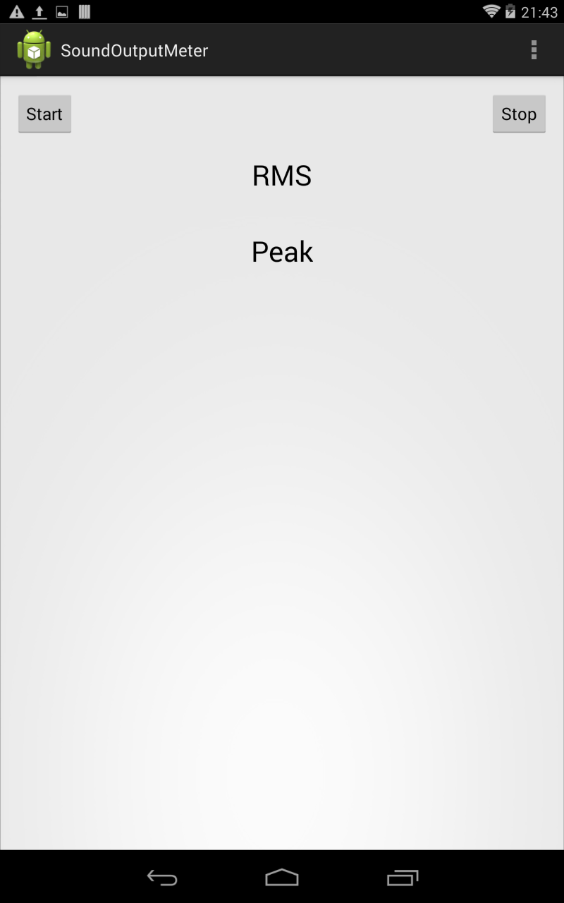
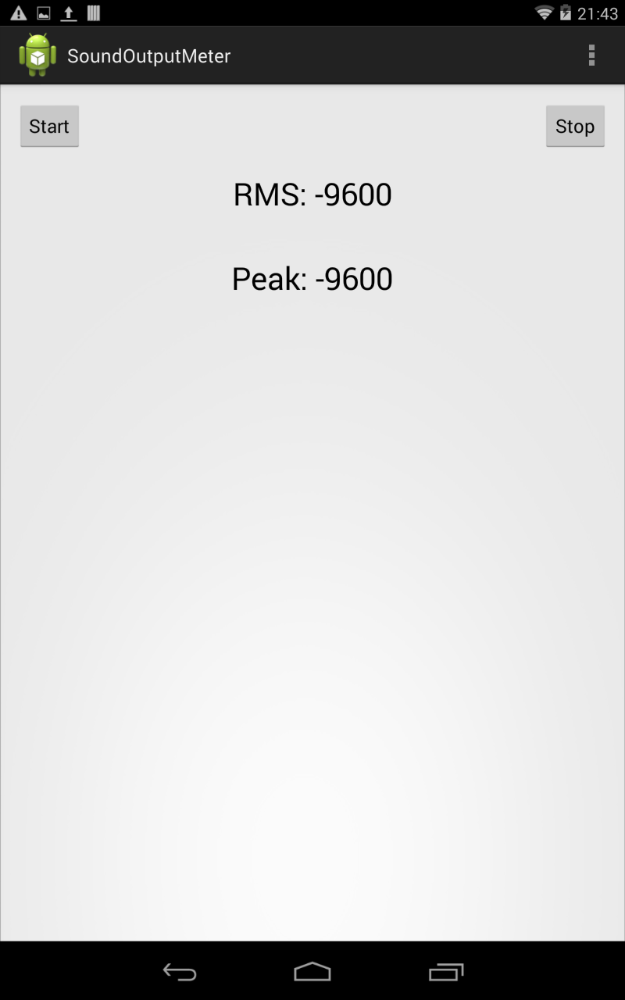
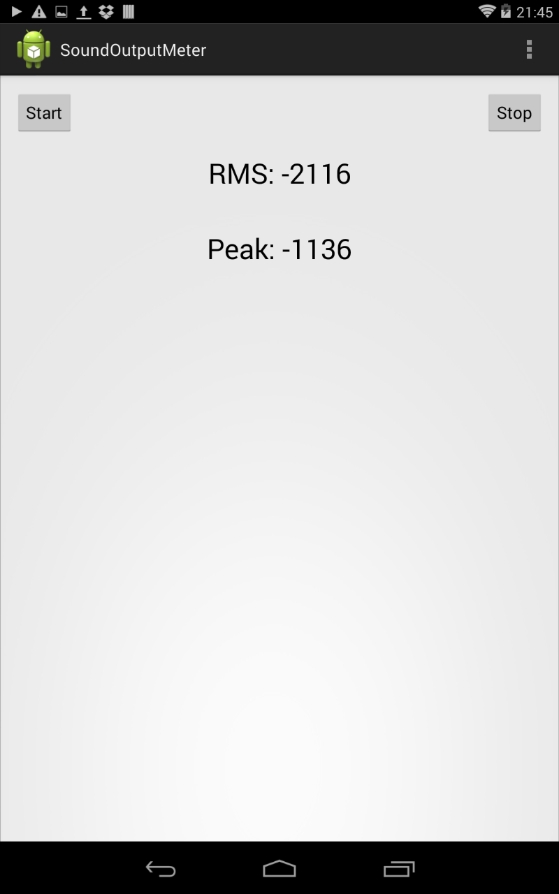
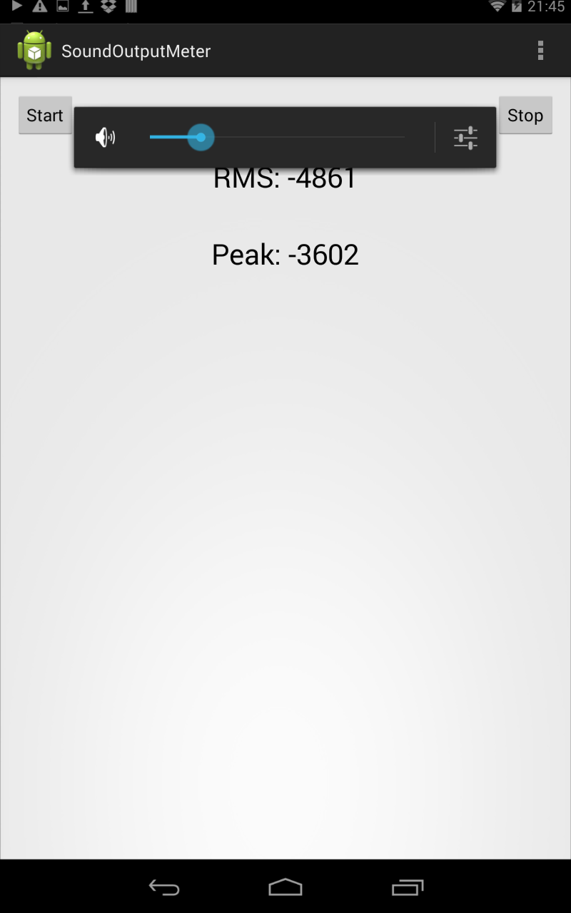
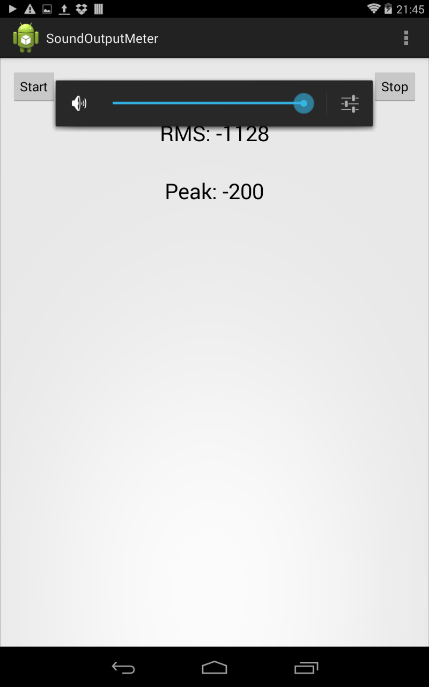

# Android KitKat: finger-by-finger 

## Measuring the sound output level with Visualizer

The `Visualizer` class has been around since Gingerbread (API level 9), but
KitKat sees the introduction of new functionality for measuring the current
level of output sounds. It has a pretty simple API, and in this article we'll
take a look at how to use this new functionality by building a sound meter app
which will measure the level of the device audio output.

The source code for this project is available in the GitHub repo at
GITHUB_LINK_HERE. It's a gradle based project, and can easily be imported into
Android Studio. It has been tested using Android Studio 0.4.4.

### The Visualizer class

The `Visualizer` class is provided to enable the sampling of currently-playing
data for some kind of visualization - hence the name. It has traditionally been
able to provide samples in the temporal or frequency domains, but the advent of
KitKat adds a _measurement_ API. The measurements contain both peak and RMS values,
and are accessed using the `getMeasurementPeakRms()` method. In order to get
regularly updating measurement values, we'll create a class which regularly
requests these measurement values and then publishes them - `SamplingSoundMeter`:

#### Building the SamplingSoundMeter

The `SamplingSoundMeter` class has a constructor which takes just one argument -
a so-called `SoundLevelUpdateable` object. We'll take a look at this interface in
a moment.

    public class SamplingSoundMeter {
        private SoundLevelUpdateable updateable;
        private Handler handler;
        private Runnable sampler;
        private Visualizer visualizer;

        public SamplingSoundMeter(SoundLevelUpdateable updateableObject) {
            updateable = updateableObject;
            visualizer = new Visualizer(0);
            visualizer.setMeasurementMode(Visualizer.MEASUREMENT_MODE_PEAK_RMS);
            handler = new Handler();
        }
        ...
    }

There are member variables for several components - including saving the provided
`SoundLevelUpdateable` object. We create a new `visualizer` object - providing
the argument of `0`. This value is the audioSession. If you have a particular
`MediaPlayer` or `AudioTrack` then you can specify the audio session to which it
belongs to attach the `Visualizer` to the same session. Here we use a session ID
of 0 - which means that the visualizer will apply to the output mix of the Android
device.

Then we enable measurement mode on the visualizer, by setting the measurement mode to
`MEASUREMENT_MODE_PEAK_RMS`. At the moment, this is the only measurement mode
available, but there could feasibly be additional options in the future.

`SoundLevelUpdateable` is a simple interface, which allows the setting of peak and
RMS values:

    public interface SoundLevelUpdateable {
        void setPeakValue(int peakValue);
        void setRmsValue(int rmsValue);
    }

This will allow the on-screen values to be updated as new samples are received.

There are 2 additional public methods on the `SamplingSoundMeter` class - `Start()`
and `Stop()`.

    public void Start(final int intervalMillis) {
        // Stop it if we're already running
        Stop();

        // Create a new runnable
        sampler = new Runnable() {
            @Override
            public void run() {
                updateStatus();
                handler.postDelayed(sampler, intervalMillis);
            }
        };

        // Enable the visualiser and start the sampler
        visualizer.setEnabled(true);
        sampler.run();
    }

    public void Stop() {
        handler.removeCallbacks(sampler);
        visualizer.setEnabled(false);
    }

The `Start()` method creates a new `Runnable` object which, when run, will call
the `updateStatus()` method. We'll take a look at this later. This runnable gets
also adds itself to the member `Handler` with a delay, so that the `updateStatus()`
method is called repeatedly - with a time interval provided as an argument to
`Start()`.

The `Start()` method also enables the `Visualizer` - an action which is mirrored
in the `Stop()` method, which also removes any remaining callbacks on the handler.

The `updateStatus()` method is as follows:

    private void updateStatus() {
        // Capture the sample
        Visualizer.MeasurementPeakRms measurementPeakRms = new Visualizer.MeasurementPeakRms();
        visualizer.getMeasurementPeakRms(measurementPeakRms);
        // Notify our updateable
        updateable.setPeakValue(measurementPeakRms.mPeak);
        updateable.setRmsValue(measurementPeakRms.mRms);
    }

In order to retrieve a measurement from the `Visualizer`, we must first create an
object into which the result can be passed - `Visualizer.MeasurementPeakRms`. This
is then passed into the `getMeasurementPeakRms()` method, where it is populated
with the current values - accessible as `mPeak` and `mRms`. These 2 values are
passed to the `SoundLevelUpdateable` object, as defined in the interface.

#### Using the SamplingSoundMeter

Now that we've created this class, it's pretty simple to wire it into a fragment
or activity to get it working.

The following code snippets are based around a fragment which has two buttons (one
for start and one for stop), and two text views (one to display the peak value,
the other the RMS value).

The fragment should implement the `SoundLevelUpdateable` interface:

    public class SoundMeterFragment extends Fragment implements SoundLevelUpdateable {
    }

Which means there should be implementations of 2 update methods:

    @Override
    public void setPeakValue(int peakValue) {
        ((TextView)getView().findViewById(R.id.textViewPeak)).setText("Peak: " + peakValue);
    }

    @Override
    public void setRmsValue(int rmsValue) {
        ((TextView)getView().findViewById(R.id.textViewRMS)).setText("RMS: " + rmsValue);
    }

In `OnCreateView()` we create a `SamplingSoundMeter`, and then wire up the 2
buttons:

    private SamplingSoundMeter samplingSoundMeter;

    @Override
    public View onCreateView(LayoutInflater inflater, ViewGroup container,
            Bundle savedInstanceState) {
        View rootView = inflater.inflate(R.layout.fragment_sound_meter, container, false);

        samplingSoundMeter = new SamplingSoundMeter(this);

        // Add some button handlers
        rootView.findViewById(R.id.soundmeter_start_button).setOnClickListener(new View.OnClickListener() {
            @Override
            public void onClick(View v) {
                samplingSoundMeter.Start(500);
            }
        });

        rootView.findViewById(R.id.soundmeter_stop_button).setOnClickListener(new View.OnClickListener() {
            @Override
            public void onClick(View v) {
                samplingSoundMeter.Stop();
            }
        });

        return rootView;
    }

Because of the pulling out of the `Visualizer` code into a separate class, it means
that the fragment is really simple.

Now if you run the app up, you should see something like
this:

Tapping the start button will start the audio meter:

If you start some audio playback in another app and then come back to __SoundOutputMeter__
then you'll see the values update as the audio plays:

To demonstrate that it's working you can see how the values change as the device
volume is changed:

### Conclusion

This is a relatively simple addition to the `visualizer` class, allowing you to
perform simple measurements on live audio output sessions, but it can actually
make the life of the developer quite a lot easier. Previously these values
would have had to be calculated manually using the audio sample interface of the
visualizer class, but the measurements API is a lot simpler. Using a similar
architecture to the one we've created here today will allow you to create visual
audio meters without much difficulty at all.

Don't forget that all the code for today's __SoundOutputMeter__ project is
available on Github at GITHUB_LINK_HERE.

