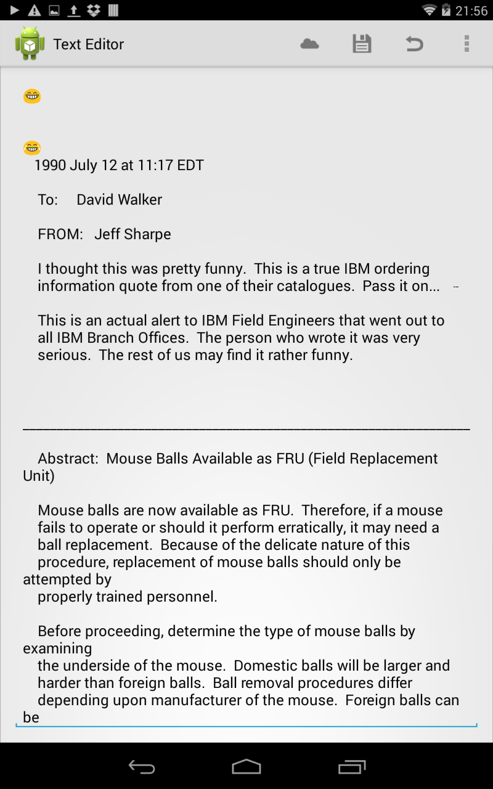

# Android KitKat: finger-by-finger 

## Creating a text editor for the cloud

The new storage access framework in KitKat provides a unified interface to a
multitude of file storage options - from on disk to cloud storage services. This
means that it's easy for any apps to view, edit and create apps across a wide
range of of storage providers.

In this article we'll take a look at how to access the storage access framework
as a consumer - i.e. providing access to storage endpoints. The framework also
supports creating new storage endpoints (document providers) - as a cloud storage
provider (e.g. dropbox) might want to. We're going to create a really simple
text-editor app, which will be able to open a text document stored in the cloud,
edit it and save the changes.

The code is available as part of the KitKat: finger-by-finger repo on Github at
GITHUB_LINK_HERE. The project is a gradle project, and should be easy to import
into Android Studio. It has been tested with Android Studio 0.4.4.

### Opening a file

Pre-KitKat, accessing files provided by other apps required selecting an app which
had provided a user-interface for interacting with the files it provides access
to. In KitKat a new intent has been created `ACTION_OPEN_DOCUMENT`, which will
provide persistent access to a document provided by a document provider. This means
that it should be used for opening a file for editing or the suchlike. If you wish
to just import a copy of an image for display then `ACTION_GET_CONTENT` continues
to be the best choice.

The following code demonstrates how simple it is to present the user with an
activity for navigation to and selection of a document:

    Intent openFileIntent = new Intent(Intent.ACTION_OPEN_DOCUMENT);

    // Only want those items which can be opened
    openFileIntent.addCategory(Intent.CATEGORY_OPENABLE);

    // Only want to see files of the plain text mime type
    openFileIntent.setType("text/plain");

    startActivityForResult(openFileIntent, READ_REQUEST_CODE);

First we create the intent, and then add some restrictions to the types of
documents we wish to be shown. We should be able to open the files
(`CATEGORY_OPENABLE`) and we're only interested in plain text files. Then we
start the activity with `startActivityForResult()`. `READ_REQUEST_CODE` is a
static `int` which we have previously defined:

    public static final int READ_REQUEST_CODE = 135;

When the document selection activity completes it will call `onActivityResult()`
on our activity, and therefore this request code is used to identify the specific
request we've kicked off.

This will present an activity as follows:

As you can see, we already have document storage providers for the local disk
and Google Drive. If you have your own storage service then the Storage Access
Framework makes it pretty easy to write a Document Provider to enable access
though this dialog. This is outside the scope of this article, but there is 
good guide available on the android developer site at
[developer.android.com](https://developer.android.com/guide/topics/providers/document-provider.html).

Once the user has completed the file selection in the document provider activity
then our activity will get a callback to `OnActivityResult()`. The following
demonstrates how to open the specified file:

    @Override
    protected void onActivityResult(int requestCode, int resultCode, Intent data) {
        if(requestCode == READ_REQUEST_CODE && resultCode == Activity.RESULT_OK) {
            // Let's see the URI
            currentOpenFileUri = null;
            if (data != null) {
                currentOpenFileUri = data.getData();
                Log.i(TAG, "URI: " + currentOpenFileUri.toString());
                // Get hold of the content of the file
                AsyncStringReader stringReader = new AsyncStringReader(getContentResolver(), textEditorFragment);
                stringReader.execute(currentOpenFileUri);
            }
        }
    }

Once we've checked that the completed activity is the one we expect (via comparison
of `requestCode`) and that the activity completed successfully (as opposed to being
canceled) then we go ahead an attempt to read the file content. One of the arguments
provided is an `Intent`, which has as its `data` property a URI through which
the document can be accessed. Here we extract the URI, and then instantiate an
`AsyncStringReader` which will read the content from the URI asynchronously. This
reader is a custom class, and we'll take a brief look at it in the next section.

#### Asynchronous String Reader

Although it's not part of the main thrust of this article, the `AsyncStringReader`
class is sufficiently interesting that it warrants further description. Android
provides an abstract class (`AsyncTask`) for performing tasks on a background
thread. It provides facility for starting a task, updating the user on progress,
and firing a completion method back on the main thread, without ever having to
deal with any threading issues.

Here we'll use an `AsyncTask` to read a string from a specified `Uri`:

    public class AsyncStringReader extends AsyncTask<Uri, Void, String>

When subclassing we fix the 3 generic types - defining the task start parameters,
the progress update return type, and the result type. Here, we provide a `Uri` to
read from, don't care about progress updates and want a `String` of the document's
content in return.

To construct an `AsyncStringReader` we require a `ContentResolver` to allow the
file to be opened, and an `AsyncStringReaderCompletionHandler` which will be
notified when the file has been read:

    private AsyncStringReaderCompletionHandler mCompletionHandler;
    private ContentResolver mContentResolver;

    public AsyncStringReader(ContentResolver contentResolver,
                             AsyncStringReaderCompletionHandler completionHandler) {
        mContentResolver   = contentResolver;
        mCompletionHandler = completionHandler;
    }

Where `AsyncStringReaderCompletionHandler` is an interface:

    public interface AsyncStringReaderCompletionHandler {
            public void setText(String s);
    }

There are 4 possible methods we could override, but we actually need only two - 
the first being `doInBackground()`, which describes the task which is performed
on the background thread:

    @Override
    protected String doInBackground(Uri... params) {
        String resultString = "";
        try{
            InputStream inputStream = mContentResolver.openInputStream(params[0]);
            if(inputStream != null) {
                BufferedReader reader = new BufferedReader(new InputStreamReader(inputStream));
                StringBuilder stringBuilder = new StringBuilder();
                String line;
                while((line = reader.readLine()) != null) {
                    stringBuilder.append(line);
                    stringBuilder.append("\n");
                }
                inputStream.close();
                resultString = stringBuilder.toString();
            }
        } catch (IOException e) {
            e.printStackTrace();
        }
        return resultString;
    }

Here we use the `ContentResolver` to get an `InputStream` from the provided `Uri`,
before using a `BufferedReader` to construct a `String` which is the content of
the file.

The other method is `onPostExecute()`, which is run back on the main thread, and
we use to send the file content to the completion handler:

    @Override
    protected void onPostExecute(String s) {
        mCompletionHandler.setText(s);
    }

#### Using the string reader

If you cast your mind back to when we used this string reader in the `onActivityResult()`
method you'll remember that we passed in a `Fragment` subclass as the completion
handler:

    public class TextEditorFragment extends Fragment implements AsyncStringReaderCompletionHandler

In the `TextEditorFragment` when we receive new text we save it in a member variable:

    private String mText;
    public void setText(String mOriginalText) {
        this.mText = mOriginalText;
        UpdateTextView();
    }

And ensure that the text view is updated appropriately:

    private void UpdateTextView() {
        // Update the text view
        setEditTextContent(mText);
    }

    private void setEditTextContent(String content) {
        getEditText().setText(content);
    }

    private EditText getEditText() {
        return (EditText)getView().findViewById(R.id.editText);
    }

There are some additional complexities associated with the interaction between
the fragment and the activity, but they're out of scope for this article. If you
run up the app at this point, then you'll be able to open a text document from
Google Drive, and get it to load into view for editing:

### Saving a file

### Pulling it all together

### Conclusion
